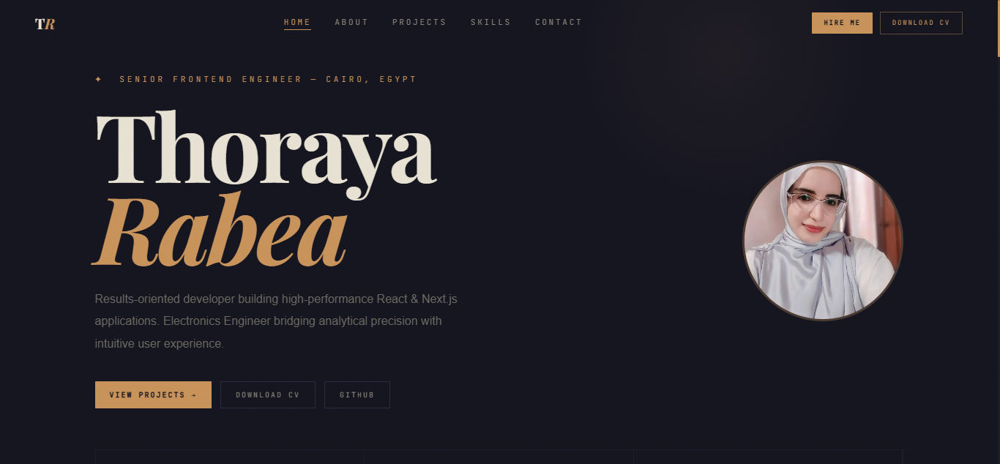

<div align="center">

# Thoraya Rabea — Portfolio

**Front-End Developer · React.js · Next.js · TypeScript**

[](https://my-portfolio-4kjp.vercel.app)




</div>

---

## Overview

A personal portfolio showcasing my work as a Front-End Developer: selected projects with live demos and source code, my tech stack, education and experience, and ways to get in touch. Designed with an editorial dark theme and built for speed and responsiveness.

**Live:** https://my-portfolio-4kjp.vercel.app

## Features

- Editorial dark design with a gold accent and expressive typography (Playfair Display, Syne, JetBrains Mono)
- Smooth scroll-reveal animations using `IntersectionObserver`
- Typewriter intro and a cursor-follow glow effect
- Active section highlighting in the navigation
- Fully responsive layout with a full-screen mobile menu
- Project cards with image, tech tags, live demo, and source code links
- One-click email copy and CV download
- Optimized images with `next/image`

## Featured Projects

| # | Project | Stack | Links |
|---|---|---|---|
| 1 | **Exam App** — online exam platform with student portal and admin dashboard | React 19, TypeScript, Vite, Tailwind, TanStack Query, Zod | [Demo](https://exam-app-three-liart.vercel.app) · [Code](https://github.com/ThorayaRabea/exam-app) |
| 2 | **Social Media App** — authentication, posts, likes, follow graph | Next.js, Redux Toolkit, MUI, Formik | [Demo](https://social-media-nextjs-blond.vercel.app) |
| 3 | **E-Commerce Admin Dashboard** — Figma-to-code analytics dashboard | Next.js, TypeScript, Redux Toolkit, MUI | [Demo](https://ecommerce-dashboard-eight-sandy.vercel.app) · [Code](https://github.com/ThorayaRabea/ecommerce-dashboard) |
| 4 | **E-Commerce Platform** — cart, auth, validated forms | React, Context API, TanStack Query | [Demo](https://ecommerce-react-app-coral.vercel.app) · [Code](https://github.com/ThorayaRabea/ecommerce-react-app) |
| 5 | **Games Collection** — Memory Game and Tic-Tac-Toe | JavaScript, DOM | [Demo](https://games-two-nu.vercel.app) · [Code](https://github.com/ThorayaRabea/Games) |
| 6 | **Weather App** — OpenWeather API integration | JavaScript, REST API | [Demo](https://weather-gamma-six-85.vercel.app) · [Code](https://github.com/ThorayaRabea/Weather) |

## Tech Stack

| Layer | Tools |
|---|---|
| Framework | Next.js 16 (App Router), React 19 |
| Language | TypeScript |
| Styling | Tailwind CSS 4 + custom CSS |
| Deployment | Vercel |
| Quality | ESLint |

## Project Structure

```
my-portfolio/
├── app/
│   ├── layout.tsx      # metadata and root layout
│   ├── page.tsx        # all sections and the PROJECTS / SKILLS / TIMELINE data
│   └── globals.css     # Tailwind import and base styles
├── public/             # project images, photo.jpg, cv.pdf
└── package.json
```

## Getting Started

```bash
git clone https://github.com/ThorayaRabea/my-portfolio.git
cd my-portfolio
npm install
npm run dev
```

Open http://localhost:3000

| Command | Description |
|---|---|
| `npm run dev` | Start the development server |
| `npm run build` | Create a production build |
| `npm run start` | Run the production build |
| `npm run lint` | Lint the code |

## Adding a New Project

1. Save a screenshot in `public/` (for example `my-project.jpg`).
2. Add an object at the top of the `PROJECTS` array in `app/page.tsx`:

```tsx
{
  title: "My Project",
  img: "/my-project.jpg",
  tech: ["React", "TypeScript"],
  description: "Short description of what it does.",
  github: "https://github.com/ThorayaRabea/my-project",
  live: "https://my-project.vercel.app",
}
```

Numbering is automatic.

## Deployment

The site is deployed on Vercel. Every push to `main` triggers a new deployment automatically.

## Contact

- Email: thorayarabea@gmail.com
- LinkedIn: https://www.linkedin.com/in/thoraya-rabea
- GitHub: https://github.com/ThorayaRabea